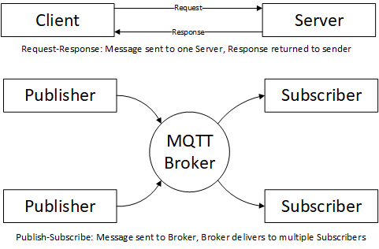

## OPC UA IIoT StarterKit
### Overview
OPC UA PubSub is an extension to OPC UA that enables communication between OPC UA applications using a Publish-Subscribe message pattern instead of the Request-Response message pattern. The Publish-Subscribe message pattern decouples senders of messages from their receivers which allows for the development if systems based on middleware such as an MQTT broker.  The difference between the two patterns is illustrated in the following figure:

The Publish-Subscribe message pattern is a powerful tool for factory owners that want to collect data from large numbers of publishers. In particular, it is a technology that is well suited for publishing factory data to the cloud. Publish-Subscribe is not well suited for use cases, such as device configuration, where a Client is blocked until it receives information back from the Server. OPC UA supports both message patterns because it is the best way to meet the complex needs of modern factories. 

The purpose of this starter is to provide a bare bones implementation of OPC UA PubSub which illustrates the following:
1) Implementing OPC UA PubSub is easy to do using standard Open-source libraries;
2) OPC UA Pub Sub allows factory owners to take advantage of the MQTT infrastructure to discover publishers in the factory;
3) Using OPC UA Information Models to configure applications and define the contents of messages. 

### Changes

|Date|Changes|
|--|--|
|2021-12-01|Added command line arguments to set MQTT broker username/password.|

### Licence and Usage Model
The code is this respository has been developed as a teaching tool and is not intended for immediate inclusion in a commercial product. 

The code in this repository is covered under the [MIT license](https://opcfoundation.org/license/mit.html), however, it requries code from an development branch of the [UA-.NETStandard](https://github.com/OPCFoundation/UA-.NETStandard) project which is has a [dual license model](https://opcfoundation.github.io/UA-.NETStandard/). 

The once the changes in the development branch are merged into the main branch, the StarterKit code will link to the UA-.NETStandard NuGet packages which are covered under the [redistributabies license agreement](https://opcfoundation.org/license/redistributables/1.3/index.html). 

### Requirements
This StarterKit contains software designed to run on a [Raspberry Pi](https://www.raspberrypi.org/products/raspberry-pi-4-model-b/) or other Linux device with GPIO ports.  

It will also run on a Linux or Windows machine without GPIO ports in simulation mode. 

This version of StarterKit uses [.NET 5.0](https://dotnet.microsoft.com/download/dotnet/). 

The recommended development tool to build for the Raspberry Pi is [Visual Studio Code](https://code.visualstudio.com/) 

The recommended development tool to build for Windows platforms is [Visual Studio 2019](https://visualstudio.microsoft.com/downloads/).

An MQTT broker is required. [Eclipse Mosquitto](https://mosquitto.org/) is used in the StarterKit documentation.  

A MQTT monitoring application, such as [MQTT Spy](https://www.eclipse.org/paho/index.php?page=components/mqtt-spy/index.php), is also helpful. 

All of the code and documentation can be found on [GitHub](https://github.com/OPCFoundation/UA-IIoT-StarterKit). 

### Next Steps

1. Setting up the Build Environment

    1.1 [Linux](docs/setup/linux) 

    1.2 [Raspberry Pi with a Windows Development Environment](docs/setup/raspberrypi) 

2. [Running the MQTT Agent](docs/agent)
3. [Publishing Data](docs/publishing)
4. [Discovering Publishers](docs/discovery)
5. [Subscribing to Data](docs/subscribing)
5. [Subscribing to MetaData](docs/metadata)
6. [Information Models](docs/models)
