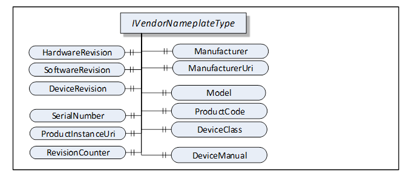
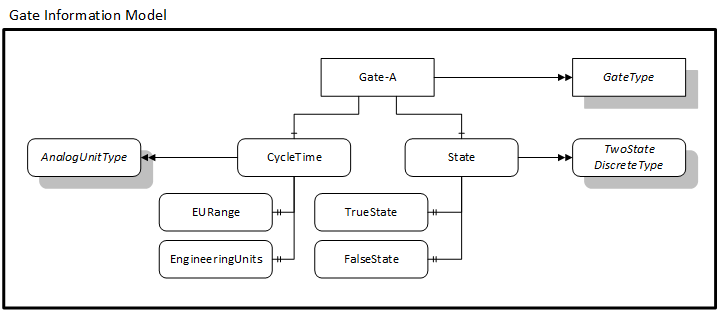

## OPC UA IoT Toolkit – Information Models
### Overview
This page describes the information models exposed by the publisher.

Information models are the most important feature of OPC UA PubSub because they provide a standard way 

### VendorNameplate
The VendorNameplate provides informance about the device or application which is the source of data. 

The elements of the VendorNameplate are shown in the following figure: 

 

A complete description of the field in the VendorNameplate can be found [here](https://reference.opcfoundation.org/DI/docs/4.5.2/).

In the samples, the VendorNameplate is published by every subscriber. 

### Single LED
The Single LED model describes a single LED that periodically turns on and off. The current state of the LED is publsihed.

The elements of the Single LED model are shown in the following figure: 

 

The single LED builds on standard information model elements. 

The current state of the LED if represented by a TwoStateDiscreteType which described [here](https://reference.opcfoundation.org/v104/Core/docs/Part8/5.3.3/#5.3.3.2). 

The cycle time of the LED is represented by an AnalogUnitType which is described [here](https://reference.opcfoundation.org/v104/Core/docs/Part8/5.3.2/#5.3.2.4). 

The metadatda that is published with the current include the value of the TrueState and FalseState.
