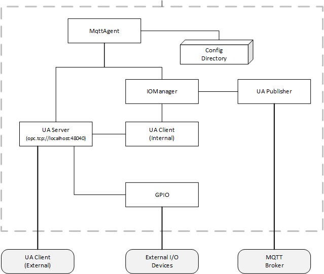

## OPC UA IoT StarterKit – Publishing Data
### Overview

1. [Command Line Arguments](#1)
2. [Configuring the Publisher](#2)
3. [Running the Publisher](#3)
4. [Using GPIO](#4)

### <a name='1'>Command Line Arguments

The command line parameters are:
```
Usage: MqttAgent publish [options]

Options:
  -?|-h|--help                        Show help information
  -b|--broker                         The MQTT broker URL. Overrides the setting in the connection configuration.
  -c|--connection                     The file containing the the OPC UA PubSub connection configuration.
  -d|--datasets                       The directory containing the the OPC UA PubSub dataset configurations.
  -a|--application                    A unique name for the application instance. Overrides the setting in the connection configuration.
  -n|--nameplate <NameplaceFilePath>  The file containing the the nameplate information provided by the publisher.
  -g|--gpio                           Use GPIO instead of a software simulator.
```
The MQTT topic tree used by the Starter Kit applications have the pattern:
```
opcua/<application>/<group>/<dataset>
```
Where 

&lt;application&gt; is the value passed with the --application option. 

&lt;group&gt; the name of the WriterGroup.

&lt;dataset&gt; name of the dataset. 

### <a name='2'>Configuring the Publish

The publisher configuration [file](https://github.com/OPCF-Members/UA-IoT-StarterKit/blob/master/MqttAgent/config/publisher-connection.json) is used to configure the UA PubSub publisher. The structure of the file: 

    ReaderGroups []
        DataSetWriters []
            DataSetName: <The DataSet Name>
            TransportSettings
                QueueName: <MQTT Topic Name>

In the StarterKit examples, the "DataSetName" in the DataSetWriter is used to locate the current DataSet metadata [file](https://github.com/OPCF-Members/UA-IoT-StarterKit/blob/master/MqttAgent/config/datasets/gate.json). 

An example [dataset](https://github.com/OPCF-Members/UA-IoT-StarterKit/blob/master/MqttAgent/config/datasets/gate.json) represents a conveyor belt gate with two sensors. The structure of the file: 

    Fields []
        Name : <The Field Name>
        Properties []
            <Additional Metadata>

The "Fields" array specifies the name and order of elements that appear in the UA PubSub message. Each field may have additional properties, such as EURange, which may be used to interpret the published data. The complete definition of the file structure is [here](https://reference.opcfoundation.org/v104/Core/docs/Part14/6.2.2/#6.2.2.1.2).

### <a name='3'>Running the Publisher

The publisher can be started with the following command:
```
dotnet MqttAgent.dll publish -b=mqtt://[broker ip]:1883 -a=MyPublisher
```
Where 

[broker ip] is the the IP address or DNS name of the broker machine; 

The publisher will publish to 3 topics:

    opcua/<application>/identity; 
    opcua/<application>/simple/gate; 
    opcua/<application>/full/gate; 

Where &lt;application&gt; is the value passed with the "-a" option. 

The identity topic is used to publish the nameplate information and allow the discovery of publishers on the network. 

The simple and full topics are used to publish data collected by the server (see [subscribing](../subscribing/)). 

When running on a platform with GPIO hardware, such as a Raspberry Pi, the publisher can be started wth GPIO enabled with this command:
```
sudo ~/dotnet/dotnet MqttAgent.dll publish -b=mqtt://[broker ip]:1883 -a=MyPublisher --gpio
```
GPIO hardware requires elevated permissions. The "sudo" can be omitted if the current user has been granted those permissions by default. 

### <a name='4'>Using GPIO

The StarterKit includes the software shown in the following figure: 

 

The OPC UA Server provides an interface to the GPIO hardward on the device. If no GPIO hardware is detected the OPC UA Server reverts to a simulation mode. 

The IOManager collects the data published by the Publisher. It supports different sources including a generic OPC UA Client that can collect data from any OPC UA Server. The files used to configure the OPC UA Client are in the ["sources"](https://github.com/OPCF-Members/UA-IoT-StarterKit/tree/master/MqttAgent/config/sources) directory. These files link a DataSet to a set of Variables which provide the published data. The name of the file is used to correlate a source with a DataSet. The contents of the file are described [here](https://reference.opcfoundation.org/v104/Core/docs/Part14/6.2.2/#6.2.2.6.2).

The OPC UA Server encapulates the GPIO code in GPIO modules such as [this](https://github.com/OPCF-Members/UA-IoT-StarterKit/blob/master/MqttAgent/Server/GPIOGateMonitor.cs). These modules create an OPC UA information to represent the devices connected to the GPIO and handles reads/writes to the GPIO. 

The code assumes a Raspberry Pi with a pinout described [here](https://pinout.xyz/pinout/pin11_gpio17#). The GPIO library incorporated into the samples uses the logical pin numbers (i.e. 17). 

An external OPC UA Client, such as [UA Expert](https://www.unified-automation.com/products/development-tools/uaexpert.html) may be used to directly access the GPIO components. It can be used to write to the GPIO and trigger changes in the data published.


